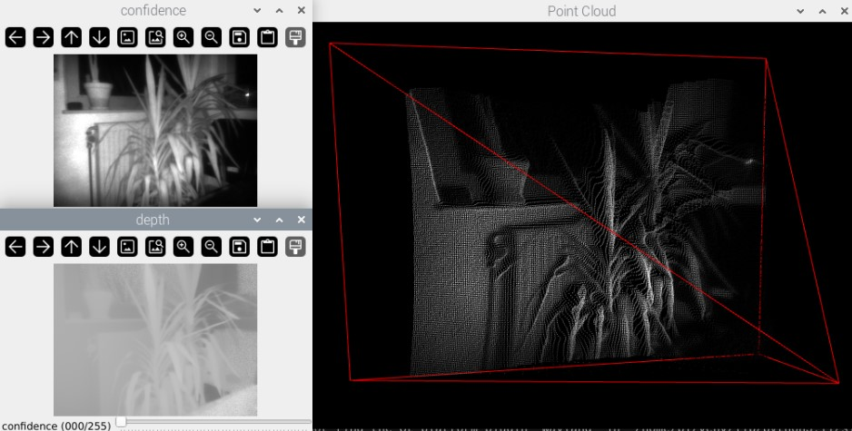
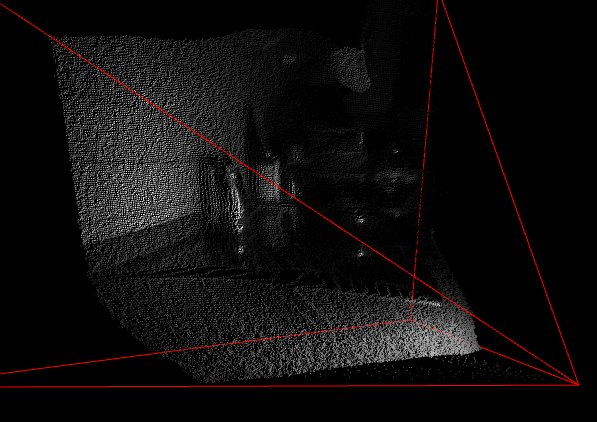
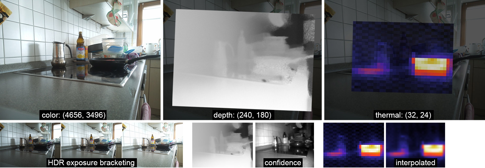

# Sensorpack

**! Work in progress !**

a Raspberry Pi Camera Array containing depth, thermal and RGB cameras.  
The device contains a Pi Pico/Pico2 to preprocess the thermal sensor data. It might also receive a BNO055 absolute orientation sensor later.

This is a personal project. I want to gain some experience with the sensors and their calibration and registration.

I used a Pi5 as host since we need two CSI-ports, but you may also be successful with a CM4 or some CSI multiplexer.

## Hardware


Devices:
- Arducam ToF Camera ([info](https://www.arducam.com/time-of-flight-camera-raspberry-pi/))
- Raspberry Pi Camera Module 3 ([info](https://www.raspberrypi.com/products/raspberry-pi-camera-3/))
- Pimoroni MLX90640 Thermal Camera Breakout 55° ([shop](https://shop.pimoroni.com/products/mlx90640-thermal-camera-breakout?variant=12536948654163))
- Raspberry Pi Pico / Pico 2
- Raspberry Pi 5

The enclosure is designed in 3ds Max and printed using Prusa Slicer in PETG for durability. project (max), exports (obj) and slicer (3mf) files are included.


## clone including submodules

```
git clone https://github.com/LaserBorg/Sensorpack.git
cd Sensorpack  
git submodule update --init --recursive
```


## build Arducam Pivariety camera driver to install the ToF camera

this was the original forum thread from April 2024 where I tried to get ToF + 16MP running with in Bookworm:  
https://forum.arducam.com/t/installation-tof-camera-fails-on-bookworm-could-not-open-device-node-dev-video0/5883/29

install the Arducam Pivariety Driver for the ToF camera as described ([troubleshooting](https://docs.arducam.com/Raspberry-Pi-Camera/Tof-camera/Troubleshooting/#4-cannot-be-used-on-raspberry-pi5)):
https://docs.arducam.com/Raspberry-Pi-Camera/Tof-camera/Getting-Started/

The RGB camera is a Raspberry Pi Camera Module 3, which is natively supported by libcamera — no extra driver needed.

With the Pi Cam 3 at CSI-0 and the ToF at CSI-1 attached, make sure your /boot/firmware/config.txt looks like this:

    dtoverlay=arducam-pivariety

I used these commands to check if the cameras are connected: 

    dmesg | grep arducam
    media-ctl -p

my ToF camera is ID 8, which is required to initialize the camera driver.

## Thermal
I modified existing implementations to send the image buffer via USB serial connection to a receiver script on the host computer. 
The submodule repo contains forks for Pico implementations running:

- Circuitpython
- Micropython
- Pico SDK
- Arduino.

Currently I'm sticking with CircuitPython, simply for ease of use.

#### Performance
Andre Weinand's [Pico SDK implementation](https://github.com/weinand/thermal-imaging-camera) provides ~ 23 fps, but unfortunately I'm not fluent with C++ and Piko SDK.

Micropython was ~4 fps and Circuitpython is even worse, so I I swapped the Pico for a Pico 2, which improved the performance a bit.

## Libcamera

some Info about Libcamera commands:
- https://www.raspberrypi.com/documentation/computers/camera_software.html

The RGB camera is a Raspberry Pi Camera Module 3 (62° FOV). It has moderate lens distortion, so it should be calibrated with a pinhole model plus distortion coefficients (`cv2.calibrateCamera`) rather than assuming an ideal pinhole.

example rpicam (= libcamera) command for a fixed exposure and gain: 

    rpicam-still --width 1920 --height 1080 --shutter 500000 --gain 2 -e png -o RGB/image.png

`python RGB/RGB-cam.py` captures three JPEGs at different shutter times with
fixed gain and white balance, then writes a floating-point Radiance `.hdr` file
to `RGB/output/`. It saves the actual exposure metadata in a `bracket_*.json`
sidecar and estimates a per-channel JPEG response curve on the first run,
reusing `RGB/output/camera_response.npz` while gain, white balance, and image
size match. Keep the scene still during the bracket. Delete the response cache
if you change camera mode, ISP processing, or JPEG settings; the existing older
JPEGs have no measured exposure metadata and cannot be merged reliably as-is.

## Open3D 




#### point cloud rendering

I tried to replicate the Arducam pointcloud example (C++) using Python and used the Open3D [visualization examples](https://www.open3d.org/html/python_example/visualization/index.html) as a reference.

The depth buffer contains per-pixel **slant-range** readings (distance along each ray, in mm), not a planar z-depth. To get a proper pinhole z-depth you divide by the ray's normalized length: `z = d / sqrt(x² + y² + 1)` where `x=(u-cx)/fx`, `y=(v-cy)/fy` (see `convert_distance_to_zdepth`).

The pivariety driver exposes the camera's **firmware-calibrated intrinsics** (`INTRINSIC_FX/FY/CX/CY`, raw values are ×100), which is far more accurate than assuming a nominal FOV. `get_intrinsic_driver()` reads them directly. Note the driver does *not* return cartesian coordinates — it only gives the depth buffer plus these intrinsics, so the slant→z conversion above is still required.

#### OpenGL
because Raspberry Pi only supports OpenGL ES which seems to be not compatible to Open3D, we need to switch to software rendering:

    import os
    os.environ["LIBGL_ALWAYS_SOFTWARE"] = "1"

## Alignment



The active RGB/ToF calibration workflow and capture instructions are in [alignment/README.md](alignment/README.md) and [plan.md](plan.md). Because the RGB and ToF cameras are not coaxial, a single-plane homography is not enough: matched checkerboard views allow independent board poses (`cv2.solvePnP`) and a 6-DoF transform from ToF points into RGB image coordinates. Thermal registration remains future work.

## Joint Bilateral Upscaling

I plan to upscale Depth (240x180) and Thermal (32x24) data using Joint Bilateral Upscaling (JBU) with RGB as reference. It is forked from [Martin Zurowietz's](https://github.com/mzur) implementation of Johannes Kopf's [publication](https://johanneskopf.de/publications/jbu/).

the code is located in a separate repo:  
https://github.com/LaserBorg/pyJBU

I used Cython, multiprocessing and single channel kernels (instead of RGB) to significantly improve execution speed.

## BNO055 Absolute Orientation Sensor

I haven't integrated the sensor in the enclosure design yet, but a basic version of the sender code for CircuitPython (Pico) and the receiver script for the host (Pi5) is already provided for testing purposes.